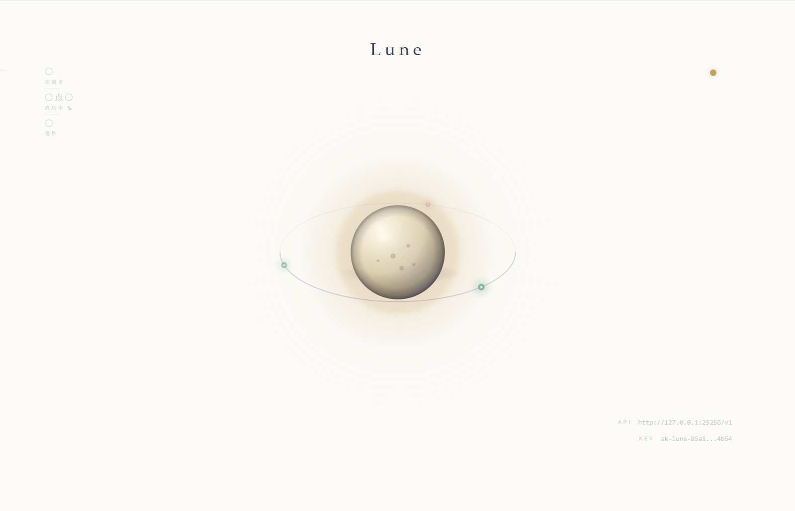
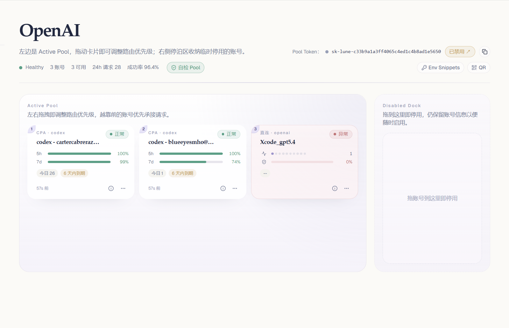

# Lune 🌙

> 一座安静的、为我自己点亮的 LLM 网关。
>
> 我每天用它对话、写代码、做实验。它在本机上跑着，单二进制，不打扰任何人。
> 如果你也需要一个这样的东西，欢迎带走。

[](./LICENSE)
[](https://github.com/Noreply1018/lune/releases)
[](https://github.com/Noreply1018/lune/pkgs/container/lune)
[](https://hub.docker.com/r/noreply1018/lune)



## 关于 Lune

Lune 是一个面向**个人使用**的 LLM API 网关：对下游暴露 OpenAI 兼容接口，对上游支持两种账号来源——OpenAI 兼容 Provider 直连，以及通过 **CPA 服务**（CLI Proxy API）聚合的通道。

> 做 Lune 是因为 OneAPI 对个人用户来说太重，LiteLLM 又缺一个能看的管理页面。
> 我想要一个能装进口袋、有一点自己风格、晚上不用想着它的东西。

**架构：** `Client → Lune（鉴权 + 路由）→ LLM Provider / CPA 服务`

**技术栈：** Go（网关）· TypeScript/React（管理界面）· SQLite（持久化）

## 它会做什么

- **双源账号** — OpenAI 兼容直连 + CPA 服务聚合，统一池化路由
- **账号池** — Priority-weighted 调度、自动重试、健康检查
- **模型路由** — alias → pool → account → upstream，支持混合 pool
- **CPA 服务管理** — Device Code 登录 OpenAI Codex、凭据热加载、远程账号批量导入、过期预警
- **体验细节** — Provider 模板自动填充、一键测试连接、Pool 级 Codex CLI、内置 Playground
- **观测** — 成本估算、延迟百分位追踪（p50/p95/p99）、账号级 Sparkline



## 关于 CPA 服务

你可能第一次听说 CPA——它是 [CLI Proxy API](https://github.com/router-for-me/CLIProxyAPI) 的简称，把 Claude Code、OpenAI Codex CLI 这类工具的登录凭据包装成统一的 OpenAI 兼容接口。

Lune 做的事，是把 CPA 当成**另一类账号来源**：你可以直接把 API Key 填进 Lune（`openai_compat` 模式），也可以让 Lune 通过 CPA 托管一批 CLI 登录账号（`cpa` 模式）。两种账号并存在同一个池里，Lune 负责挑一条可用的路发出去。

什么时候用哪种？大致是：

- **手头有 API Key** → 直连，最短路径
- **只有 CLI 登录**（比如 ChatGPT Plus 的 Codex 访问）→ 走 CPA，让 Lune 帮你做凭据管理和过期预警

## 快速开始：Docker Desktop

适合第一次使用、只想把 Lune 跑起来的用户。Lune 默认是一个完整镜像：管理界面、网关后端和内置 CPA runtime 都在同一个容器里。

### 1. 拉取镜像

打开 Docker Desktop，进入 **Images**，搜索并拉取：

```text
noreply1018/lune:latest
```

也可以在终端执行：

```bash
docker pull noreply1018/lune:latest
```

### 2. Run 容器

在 Docker Desktop 的镜像列表里点击 `noreply1018/lune:latest` 右侧的 **Run**。

推荐填写：

| 项目 | 值 |
|---|---|
| Container name | `lune` |
| Host port | `7788` |
| Container port | `7788` |
| Volume | `lune-data` → `/app/data` |

首次本机使用不需要填写环境变量。Lune 会自动生成管理 token，内置 CPA runtime 的 API key 和管理密钥也会使用容器内部默认值。

如果 Docker Desktop 的 Run 界面要求选择 volume 类型，推荐使用 named volume：

| Volume name | Container path |
|---|---|
| `lune-data` | `/app/data` |

也可以用宿主机目录绑定到 `/app/data`，例如 macOS / Linux 的 `~/lune-data` 或 Windows 的 `C:\Users\<you>\lune-data`。

不要映射 `8317`。它是容器内部 Lune 访问 CPA runtime 的端口，默认不需要暴露给宿主机。

### 3. 打开管理界面

启动后访问：

```text
http://127.0.0.1:7788/admin
```

本机访问通常会直接进入管理界面；如果你设置了 `LUNE_ADMIN_TOKEN` 或通过远程地址访问，用该 token 登录。进入后可以：

- 在 Settings 查看 Runtime 和 CPA Runtime 状态
- 在 Pools / Add Account 里添加直连 API Key 账号
- 使用 CPA 登录 Codex 类账号
- 进入 Pool 详情页，点击 **Codex CLI** 生成 Codex CLI 配置

### 4. 更新镜像

在 Docker Desktop 里重新 Pull `noreply1018/lune:latest`，然后重新创建容器，并继续挂载同一个 `lune-data` volume。

如果你使用固定版本，建议拉取类似：

```text
noreply1018/lune:0.1.5
```

## 服务器 / Compose 运行

适合希望把配置落到 `.env`、用命令行长期运行的用户：

```bash
curl -O https://raw.githubusercontent.com/Noreply1018/lune/main/docker-compose.prod.yml
curl -O https://raw.githubusercontent.com/Noreply1018/lune/main/.env.example
cp .env.example .env

docker compose -f docker-compose.prod.yml --env-file .env up -d
```

默认生产 compose 从 GHCR 拉取镜像。如需 Docker Hub，把 `.env` 里的 `LUNE_IMAGE` 改成：

```env
LUNE_IMAGE=docker.io/noreply1018/lune
```

启动后访问 `http://127.0.0.1:7788/admin`。

**升级：**

```bash
docker compose -f docker-compose.prod.yml --env-file .env pull
docker compose -f docker-compose.prod.yml --env-file .env up -d
```

**停止 / 查看日志：**

```bash
docker compose -f docker-compose.prod.yml --env-file .env down   # 停止（保留数据卷）
docker compose -f docker-compose.prod.yml logs -f lune           # 跟随 Lune + CPA 日志
```

## 配置

Docker Desktop 用户可以在 Run 界面的 Environment variables 里填写配置；Compose 用户通过根目录的 `.env` 文件配置，`docker compose` 会自动读取它并注入到容器环境变量里。

个人本机使用没有必填环境变量。只有在远程访问、反代部署、改端口或调试内部 CPA 布线时，才需要显式设置。

仓库提供 [.env.example](./.env.example) 作为模板。本地使用时复制一份：

```bash
cp .env.example .env
# 按需修改 LUNE_PORT；远程访问时再设置 LUNE_ADMIN_TOKEN
```

`.env` 已被 `.gitignore` 忽略。下表是 Lune 能识别的**全部**环境变量——`.env.example` 只列出日常需要修改的几项，其余（如数据目录、内置 CPA 地址）由 `docker-compose.yml` 直接固定在容器里，一般不需要动。

### 常用环境变量

| 变量 | 用途 | 默认值 |
|---|---|---|
| `LUNE_IMAGE` | 预构建镜像仓库（GHCR / Docker Hub） | `ghcr.io/noreply1018/lune` |
| `LUNE_IMAGE_TAG` | 预构建镜像 tag（用于 `docker-compose.prod.yml`） | `latest` |
| `LUNE_PORT` | HTTP 服务端口 | `7788` |
| `LUNE_DATA_DIR` | SQLite 数据目录 | `./data` |
| `LUNE_ADMIN_TOKEN` | 管理令牌覆盖；远程访问或反代部署时建议设置 | 自动生成 |
| `LUNE_LOG_LEVEL` | 日志级别：`debug` / `info` / `warn` / `error` | `info` |
| `LUNE_LOG_FORMAT` | 日志格式：`text` / `json` | `text` |

### 高级 / 内部环境变量

这些变量用于内置 CPA runtime 和 Lune 之间的容器内部通信，Docker Desktop 本机使用不需要填写。

| 变量 | 用途 | 默认值 |
|---|---|---|
| `LUNE_CPA_AUTH_DIR` | CPA 凭据文件目录 | Docker: `/app/data/cpa-auth` |
| `LUNE_CPA_BASE_URL` | Lune 连接 CPA 的地址 | Docker: `http://127.0.0.1:8317` |
| `LUNE_CPA_API_KEY` | Lune 使用的 CPA API Key | 同 `CPA_API_KEY` |
| `LUNE_CPA_MANAGEMENT_KEY` | Lune 访问 CPA 管理 API 的密钥 | `lune-cpa-management-dev` |
| `CPA_API_KEY` | CPA 服务 API Key | `sk-cpa-default` |
| `LUNE_EMBEDDED_CPA` | 是否启动镜像内置 CPA：`1` / `0` | `1` |
| `LUNE_GATEWAY_TMP_DIR` | 大请求重放临时目录 | Docker: `/app/data/tmp` |

### 访问安全

默认 Compose 只把管理端口绑定到 `127.0.0.1`。Docker Desktop 手动 Run 时也建议只在本机使用，不要把 `7788` 暴露到公网或不可信局域网。

如果你需要远程访问，请至少设置 `LUNE_ADMIN_TOKEN`，并通过可信反向代理、VPN 或防火墙限制访问来源。当前版本为了本机 Docker Desktop 体验，会信任 loopback 和私有网络来源；更严格的远程访问认证策略已放入后续版本计划。

## Docker 与 CPA 服务

CPA 是 Lune 默认镜像内置的运行时能力。镜像内的 `CLIProxyAPI` 会随 Lune 一起启动，版本由 Lune release 固定；如需新版 CPA，升级 Lune 镜像即可。

在 Docker Compose 场景下：

- `./scripts/up.sh` 会启动单个 `lune` 容器，容器内同时运行 Lune 和 CPA
- Lune 默认通过 `http://127.0.0.1:8317` 访问内置 CPA 服务
- CPA 配置由入口脚本根据环境变量自动生成，无需维护 `cpa-config.yaml`
- 默认只挂载一个数据卷到 `/app/data`，SQLite、CPA 凭据和网关临时文件都在这个目录下
- 双方通过容器内 `/app/data/cpa-auth` 目录交换凭据文件：Lune 直接对接 OpenAI Device Code 登录后将凭据写入该目录，CPA 服务热加载自动识别
- 网关请求体默认上限为 100MB，超过 8MB 的请求会写入 `/app/data/tmp` 用于重试重放，避免全部常驻内存
- OAuth 授权页依赖容器内的系统 CA 证书；如果你自定义运行镜像，确保安装了 `ca-certificates`
- 如果公司网络会拦截 HTTPS，需要把企业根证书注入容器或宿主机信任链，不能通过关闭 TLS 校验绕过

## 本地开发

Lune 的日常开发流程也走 Docker Compose，无需在本机装 Go 或 Node——所有构建都在 `./scripts/rebuild.sh` 触发的镜像构建里完成。

```bash
./scripts/up.sh
```

这会启动内置 CPA 的 Lune 容器，并在终端打印当前访问地址。地址展示会优先取运行中的 Docker 端口映射，拿不到时再回退到 `LUNE_PORT` 环境变量或 `.env` 文件。

所有常用操作都统一通过 `scripts/` 下的 Docker 包装脚本完成：

```bash
./scripts/up.sh               # 启动 Lune（内置 CPA），并打印访问地址
./scripts/restart.sh          # 默认重启 Lune
./scripts/logs.sh             # 默认跟随 Lune 日志
./scripts/ps.sh               # 查看容器状态
./scripts/down.sh             # 停止并移除容器
./scripts/rebuild.sh          # 重新构建并启动
```

本地开发推荐使用 Docker Compose。普通使用者优先使用 Docker Desktop 直接运行预构建镜像。

## HTTP 接口

### 健康检查

| 方法 | 路径 | 说明 |
|---|---|---|
| GET | `/healthz` | 存活检查，始终 200 |
| GET | `/readyz` | 就绪检查，需至少一个 account |

### 管理界面

| 方法 | 路径 | 说明 |
|---|---|---|
| GET | `/` | 重定向到 `/admin` |
| GET | `/admin`, `/admin/*` | 嵌入式 React SPA |

### 管理 API（`/admin/api/*`）

Localhost 及私有网络免认证，远程需 Bearer admin token。

| 资源 | 接口 |
|---|---|
| Accounts | `GET/POST /accounts`, `PUT/DELETE /accounts/{id}`, `POST /accounts/{id}/enable\|disable` |
| Accounts 扩展 | `POST /accounts/test-connection`, `POST /accounts/{id}/discover-models`, `GET /accounts/{id}/models` |
| Pools | `GET/POST /pools`, `GET/PUT/DELETE /pools/{id}`, `POST /pools/{id}/enable\|disable` |
| Pool Members | `POST /pools/{id}/members`, `PUT /pools/{id}/members/reorder`, `PUT/DELETE /pools/{id}/members/{member_id}` |
| Pool Tokens | `GET /pools/{id}/tokens` |
| Tokens | `GET /tokens`, `PUT /tokens/{id}`, `POST /tokens/{id}/reveal`, `POST /tokens/{id}/regenerate` |
| Settings | `GET/PUT /settings`, `GET /settings/data-retention`, `POST /settings/data-retention/prune` |
| Notifications | `GET/PUT /notifications/settings`, `PUT /notifications/subscriptions/{event}`, `POST /notifications/test`, `GET /notifications/deliveries` |
| Stats | `GET /overview`, `GET /usage`, `GET /usage/latency`, `GET /export`, `POST /import` |
| CPA 服务 | `GET/PUT/DELETE /cpa/service`, `POST /cpa/service/test\|enable\|disable` |
| CPA 登录 | `POST /accounts/cpa/login-sessions`, `GET /accounts/cpa/login-sessions/{id}`, `POST /accounts/cpa/login-sessions/{id}/cancel` |
| CPA 导入 | `GET /cpa/service/remote-accounts`, `POST /accounts/cpa/import`, `POST /accounts/cpa/import/batch` |

### 网关接口（`/v1/*`、`/openai/v1/*`）

Bearer Pool access token 认证。每个 Pool 自动拥有一条访问凭证，客户端请求只会在该 Pool 内路由；`X-Lune-Account-Id` 仅能指定同一 Pool 内的账号。

| 方法 | 路径 | 说明 |
|---|---|---|
| GET | `/v1/models` | 当前 Pool 可用模型列表 |
| POST | `/v1/chat/completions` | 代理到上游（支持 streaming） |
| POST | `/v1/*` | 其他 OpenAI 兼容端点透传 |

## License

Lune 以 [Apache-2.0](./LICENSE) 协议开源。你可以自由使用、修改和分发本项目，但需要遵守许可证中的声明保留与授权条件。
